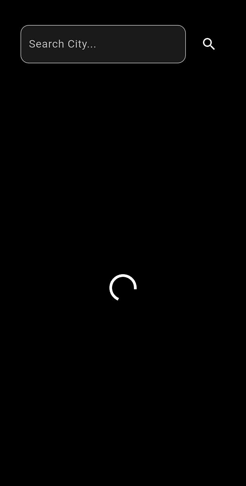
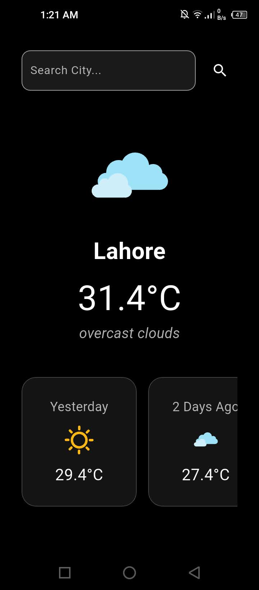

# 🌤️ SkyZen - Weather Forecast App

SkyZen is a sleek and minimalistic weather app built using **Flutter**, providing real-time weather updates with animations and intuitive UI.

---

## 📸 Screenshots

### 🚀 Splash Screen


### 🔄 Loading Screen


### 🏙️ Home Screen


---

## 🔧 Features

- 🌍 Search weather by city name
- 🌦️ Real-time weather updates
- 💫 Beautiful Lottie animations based on weather type
- 📅 Simulated past 3-day weather preview
- ❄️ Frosted glass UI design for cards
- 🌓 Dark theme for a modern feel

---

## 📱 Tech Stack

- **Flutter**
- **OpenWeatherMap API**
- **Lottie animations**
- **GitHub for version control**

---

## 📦 Installation


```bash
git clone https://github.com/your-username/your-repo-name.git
cd your-repo-name
flutter pub get
flutter run

